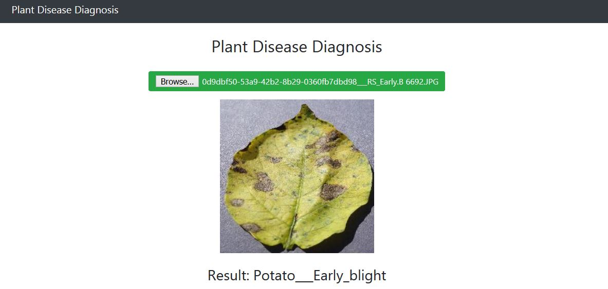

# Plant Disease Diagnosis from Leaf Images

A computer-vision project for identifying plant diseases from uploaded leaf images. The repository combines a **TensorFlow/Keras CNN workflow** with a lightweight **Flask inference application** that accepts an image, preprocesses it to 64×64 pixels, and returns the predicted plant-health class.

<p align="center">
  
</p>

## Overview

The project focuses on image-based classification for pepper, potato, and tomato plants. The Flask application loads a saved Keras model and exposes a `/predict` endpoint for image inference.

The prediction code supports **15 classes**:

- Pepper bell — Bacterial spot
- Pepper bell — Healthy
- Potato — Early blight
- Potato — Late blight
- Potato — Healthy
- Tomato — Bacterial spot
- Tomato — Early blight
- Tomato — Late blight
- Tomato — Leaf mold
- Tomato — Septoria leaf spot
- Tomato — Two-spotted spider mite
- Tomato — Target spot
- Tomato — Yellow leaf curl virus
- Tomato — Mosaic virus
- Tomato — Healthy

## Inference pipeline

```text
Leaf image upload
      │
      ▼
Flask `/predict`
      │
      ▼
Secure filename + save upload
      │
      ▼
Resize image to 64 × 64
      │
      ▼
Convert to NumPy array
      │
      ▼
Normalize pixels to [0, 1]
      │
      ▼
Keras CNN prediction
      │
      ▼
argmax → disease / healthy class
```

## Repository structure

```text
Plant-Disease-Diagnosis/
├── app.py                         # Flask inference server
├── plant_disease_recognition.ipynb # model-development notebook
├── demo.JPG                       # application screenshot/demo
└── README.md
```

## Flask implementation

`app.py`:

- loads `PlantCNN.h5` with TensorFlow/Keras
- serves the main page at `/`
- accepts image uploads at `/predict`
- saves uploads using `secure_filename`
- resizes input images to `64 × 64`
- normalizes pixel values
- runs `model.predict(...)`
- selects the highest-probability class with `numpy.argmax`
- can be served through `gevent.pywsgi.WSGIServer` on port `5000`

## Dataset

The model-development notebook is based on the **PlantVillage** plant-disease image dataset distributed through Kaggle:

`https://www.kaggle.com/emmarex/plantdisease`

## Local setup

A representative Python environment requires:

```bash
pip install tensorflow numpy scikit-image flask werkzeug gevent pillow jupyter
```

Then run the development notebook as needed:

```bash
jupyter notebook plant_disease_recognition.ipynb
```

### Running the Flask app

The committed `app.py` expects several runtime assets:

```text
PlantCNN.h5
uploads/
templates/index.html
```

These assets are referenced by the application but are **not present in the current repository snapshot**. Add the trained model and UI/runtime folders before launching the web app.

Once those assets are available:

```bash
python app.py
```

Then open:

```text
http://127.0.0.1:5000/
```

## Tech stack

| Area | Technology |
|---|---|
| Deep learning | TensorFlow / Keras |
| Image processing | Keras preprocessing, NumPy, scikit-image |
| Backend | Flask |
| Serving | Gevent WSGI |
| Experimentation | Jupyter Notebook |
| Domain | Computer vision / plant disease classification |

## What this project demonstrates

- Multi-class image classification
- CNN-based inference
- Image resizing and normalization
- Saved-model loading with Keras
- Mapping model outputs to human-readable labels
- Connecting an ML model to a Flask endpoint

## Limitations

This project is an academic prototype and should not be used as a substitute for agricultural or plant-pathology expertise. Accuracy can change significantly with lighting, camera conditions, backgrounds, plant varieties, and diseases not represented in the training data.

The current repository also does not contain all assets required to launch the Flask interface directly.

## Possible improvements

- Commit a reproducible `requirements.txt`
- Add a model-download/setup script instead of storing large weights in Git
- Add confidence scores to prediction responses
- Add validation for file type and upload size
- Add Grad-CAM or another visual explanation method
- Evaluate on real-world images outside PlantVillage
- Containerize the inference service
- Add automated tests for preprocessing and API behavior

---

This repository demonstrates an end-to-end path from a CNN experiment notebook to a simple web-based image-classification service.
