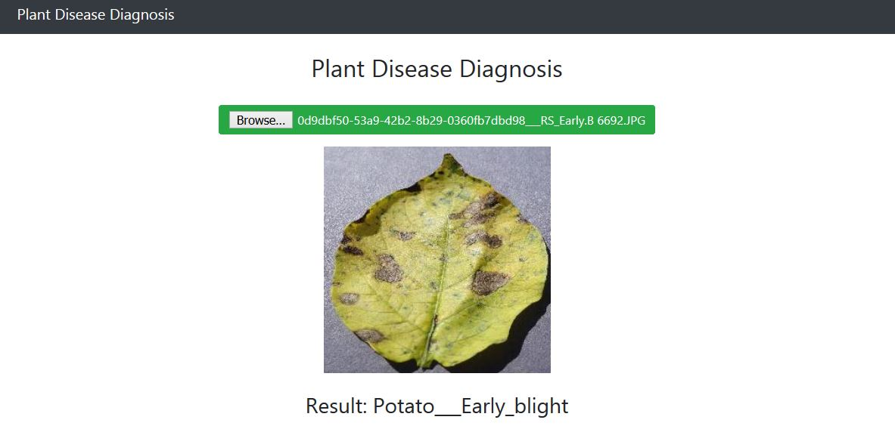

# Plant-Disease-Diagnosis

# Plant-Disease-Diagnosis-Flask
Online Flask Web App for Plant Disease Diagnosis from Images <br>

<br><br>

## Required Tools
```
Python 3.6 or greater, Tensorflow 2, Flask, Gevent, Scikit-Learn
```

## Run

```
1. Open anaconda prompt or command prompt
2. Open the directory the folder has been saved
3. type "flask run" on the terminal to run the web app

```

## Run the python backend program

```

1. Open the jupyter notebook
2. Run the file 

```

Open Browser at http://121.0.0.1:5000

## Dataset

https://www.kaggle.com/emmarex/plantdisease

## Link for the diagram drawn
https://lucid.app/lucidchart/b26e81d6-6d07-4c3a-b0d3-3fe401941569/edit?viewport_loc=-76%2C3%2C1365%2C575%2C0_0&invitationId=inv_bf93d3e3-c377-4fdf-bf1b-081b8e334cd6#


